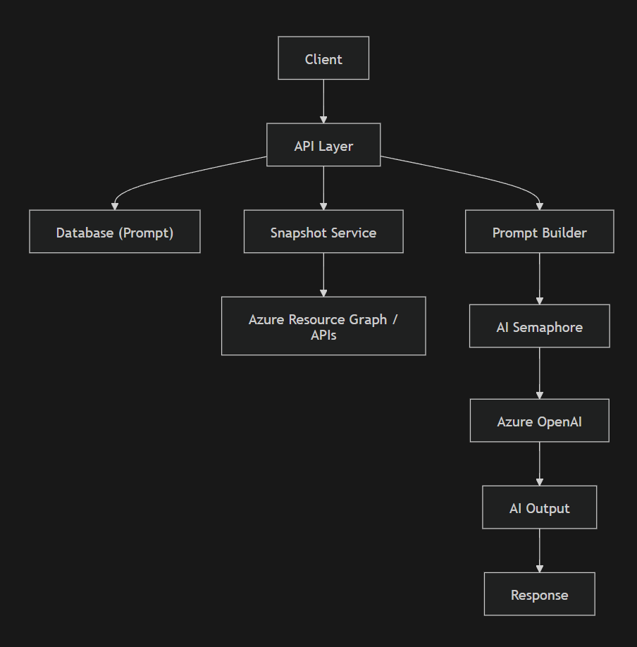

# AI Process Documentation – Evaluation Against Well-Architected Framework

## 1. Overview

The Evaluation Against Well-Architected Framework API analyzes an Azure subscription’s architecture and evaluates it against the Microsoft Azure Well-Architected Framework. It gathers a comprehensive snapshot of the environment, constructs a structured AI prompt, and leverages an AI model (Azure OpenAI) to generate architectural insights and recommendations.

---

## 2. API Purpose

This API provides:
- AI-generated architectural evaluation
- Identification of gaps and risks
- Recommendations aligned with Well-Architected principles
- Structured analysis based on real environment data

---

## 3. Components

### Core Components

- API Layer (entry point)
- Database (Prompt Storage: `ChatGPTPromptMessage`)
- Cloud Resource Snapshot Service (`GatherCloudResourceSnapshot`)
- AI Orchestrator
- Prompt Builder (template + dynamic data injection)
- AI Concurrency Control (`_aiSemaphore`)
- Azure OpenAI (Chat Completion API)
- Response Processor

---

## 4. Workflow

### Step-by-step execution

1. Receive API request
2. Validate input parameters (SubscriptionId required)
3. Retrieve prompt template from database:
   - PromptType = ArchitectureEvaluation
   - PromptName = well-architected-framework
4. Gather cloud resource snapshot:
   - Subscription metadata
   - Resource inventory
   - Role assignments
   - Policy governance
   - Networking configuration
   - Resource provider registrations
5. Construct AI prompt:
   - Inject snapshot data into template placeholders
6. Acquire AI semaphore:
   - Prevent excessive concurrent AI calls
7. Call Azure OpenAI:
   - Submit structured messages
8. Release semaphore
9. Process AI response
10. Return evaluation result

---

## 5. Data Flow

### Input

- SubscriptionId
- ResourceGroup (optional)
- AIModelDeploymentName

### Processing Flow

Request
  ↓
Validate Input
  ↓
Fetch Prompt Template (DB)
  ↓
GatherCloudResourceSnapshot
  ↓
  ├─ Subscription Metadata
  ├─ Resource Inventory
  ├─ Role Assignments
  ├─ Policy Governance
  ├─ Networking Configuration
  └─ Provider Registration
  ↓
Prompt Construction (Template Injection)
  ↓
AI Semaphore Control
  ↓
Azure OpenAI (Chat Completion)
  ↓
AI Response (Text)
  ↓
Structured Response
  ↓
Return

---

## 6. Component Interaction

| From | To | Purpose |
|------|----|--------|
| API Layer | Database | Retrieve prompt template |
| API Layer | Snapshot Service | Gather environment data |
| Snapshot Service | Azure APIs | Fetch resource data |
| API Layer | Prompt Builder | Construct AI input |
| API Layer | AI Semaphore | Control concurrency |
| API Layer | Azure OpenAI | Submit AI request |
| Azure OpenAI | API Layer | Return evaluation |
| API Layer | Response Model | Structure output |

---

## 7. Concurrency & Optimization

### AI Concurrency Control
- Uses semaphore (`_aiSemaphore`)
- Prevents overload of AI service
- Ensures controlled throughput

### Dynamic Prompt Management
- Prompts stored in database
- Enables runtime updates without redeployment

---

## 8. Response Structure

### EvaluationAgainstWellArchitectedFrameworkResponse

- Result – AI-generated evaluation text

---

## 9. Workflow Diagram

