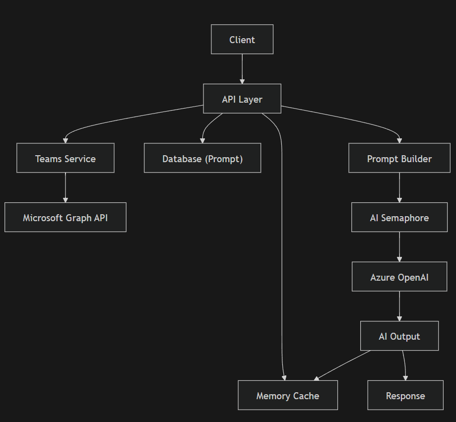

# AI Process Documentation – Summary Teams Meeting Transcripts

## 1. Overview

The Summary Teams Meeting Transcripts API retrieves Microsoft Teams meeting transcripts within a specified date range and generates an AI-driven summary. It integrates transcript retrieval, prompt construction, and AI processing while leveraging caching and concurrency control for performance and cost efficiency.

---

## 2. API Purpose

This API provides:
- AI-generated summaries of Teams meeting transcripts
- Consolidated insights across multiple meetings
- Efficient processing using caching and concurrency control

---

## 3. Components

### Core Components

- API Layer (entry point)
- Request Validator (`SummaryTeamsMeetingTranscriptsRequestValidator`)
- Memory Cache (`_memoryCache`)
- Teams Service (`_teamsService.FetchTeamsTranscripts`)
- Database (Prompt Storage: `ChatGPTPromptMessage`)
- Prompt Builder (template + transcript injection)
- AI Concurrency Control (`_aiSemaphore`)
- Azure OpenAI (Chat Completion API)
- Response Processor

---

## 4. Workflow

### Step-by-step execution

1. Receive API request
2. Validate request parameters
3. Generate cache key:
   SummaryTeamsMeetingTranscripts-{customerId}-{startDate}-{endDate}-{model}
4. If ResetCache is true:
   - Clear memory cache
5. Check memory cache:
   - If exists → return cached result
6. Fetch Teams transcripts:
   - Based on CustomerId and date range
7. Serialize transcripts into JSON string
8. Retrieve prompt template from database:
   - PromptType = Teams
   - PromptName = summarize-teams-meeting-transcripts
9. Construct AI prompt:
   - Inject transcript JSON into template
10. Acquire AI semaphore:
   - Prevent excessive concurrent AI calls
11. Call Azure OpenAI:
   - Submit structured messages
12. Release semaphore
13. Process AI response
14. Store result in cache
15. Return summary

---

## 5. Data Flow

### Input

- CustomerId
- StartDate
- EndDate
- AIModelDeploymentName

### Processing Flow

Request
  ↓
Validate Input
  ↓
Cache Key Generation
  ↓
Memory Cache Check
  ↓
Fetch Teams Transcripts
  ↓
  ├─ Meeting Metadata
  ├─ Transcript Content (WEBVTT / text)
  ↓
Serialize Transcripts (JSON)
  ↓
Fetch Prompt Template (DB)
  ↓
Prompt Construction (Template Injection)
  ↓
AI Semaphore Control
  ↓
Azure OpenAI (Chat Completion)
  ↓
AI Response (Summary Text)
  ↓
Cache Storage
  ↓
Return

---

## 6. Component Interaction

| From | To | Purpose |
|------|----|--------|
| API Layer | Validator | Validate request |
| API Layer | Memory Cache | Retrieve/store result |
| API Layer | Teams Service | Fetch transcripts |
| Teams Service | Microsoft Graph API | Retrieve meeting data |
| API Layer | Database | Retrieve prompt template |
| API Layer | Prompt Builder | Construct AI input |
| API Layer | AI Semaphore | Control concurrency |
| API Layer | Azure OpenAI | Submit AI request |
| Azure OpenAI | API Layer | Return summary |
| API Layer | Response Model | Structure output |

---

## 7. Concurrency & Optimization

### Caching
- Avoids repeated AI summarization for same input
- TTL-based expiration

### AI Concurrency Control
- Uses semaphore (`_aiSemaphore`)
- Prevents overload of AI service

### Data Serialization
- Transcripts serialized into compact JSON
- Reduces prompt size overhead

---

## 8. Response Structure

### SummaryTeamsMeetingTranscriptsResponse

- Summary – AI-generated summary of transcripts

---

## 9. Workflow Diagram

