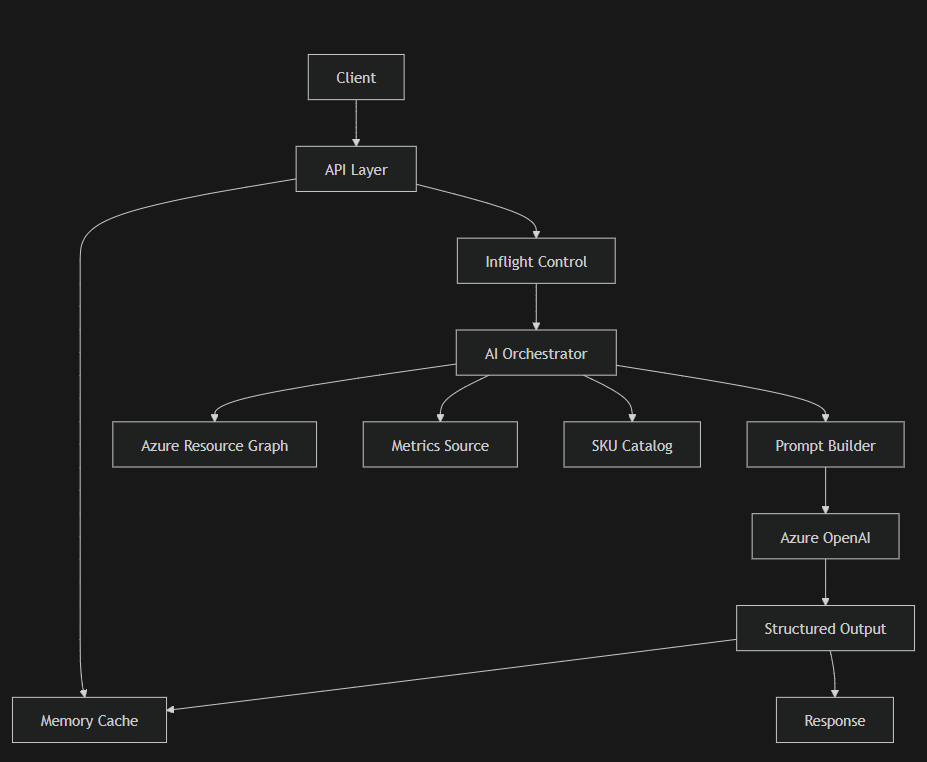

# AI Process Documentation – Virtual Machine Rightsizing

## 1. Overview

The Virtual Machine Rightsizing API evaluates Azure virtual machines and generates AI-driven SKU optimization recommendations. It uses caching and concurrency control to avoid redundant computation and integrates with an AI model (Azure OpenAI) to produce intelligent recommendations.

---

## 2. API Purpose

This API provides:
- Rightsizing direction (scale up / down / no change)
- Recommended VM SKU candidates
- AI-generated reasoning
- CLI commands for execution
- Ranked recommendations

---

## 3. Components

### Core Components

- API Layer (entry point)
- Memory Cache (`_memoryCache`)
- Inflight Deduplication (`_vmInflight`)
- AI Orchestrator (`ComputeRightsizingAsync`)
- Data Sources:
  - Azure Resource Graph (VM metadata)
  - Metrics (CPU / memory usage)
  - SKU capability catalog
- Prompt Builder
- Azure OpenAI
- Response Processor

---

## 4. Workflow

### Step-by-step execution

1. Receive API request
2. Validate input parameters
3. Generate cache key:
   AI-Rightsizing-{resourceId}-{lookBackPeriodDays}
4. If ResetCache is true:
   - Clear memory cache
   - Remove inflight task
5. Check memory cache:
   - If exists → return cached result
6. Check inflight dictionary:
   - Deduplicate concurrent requests
7. Execute computation:
   - ComputeRightsizingAsync
8. Store result in cache (TTL-based)
9. Return structured response

---

## 5. Data Flow

### Input

- ResourceId
- LookBackPeriodDays
- AIModelDeploymentName

### Processing Flow

Request
  ↓
Cache Key Generation
  ↓
Memory Cache Check
  ↓
Inflight Control Layer
  ↓
ComputeRightsizingAsync
  ↓
  ├─ Fetch VM Metadata (Resource Graph)
  ├─ Fetch Metrics (usage history)
  ├─ Fetch SKU capabilities
  ├─ Build AI Prompt
  ├─ Call Azure OpenAI
  └─ Parse AI response
  ↓
Structured Response
  ↓
Cache Storage
  ↓
Return

---

## 6. Component Interaction

| From | To | Purpose |
|------|----|--------|
| API Layer | Memory Cache | Retrieve cached result |
| API Layer | Inflight Dictionary | Prevent duplicate execution |
| API Layer | AI Orchestrator | Execute rightsizing logic |
| AI Orchestrator | Azure Resource Graph | Fetch VM metadata |
| AI Orchestrator | Metrics Source | Retrieve usage data |
| AI Orchestrator | SKU Catalog | Retrieve SKU capabilities |
| AI Orchestrator | Prompt Builder | Build AI input |
| Prompt Builder | Azure OpenAI | Submit AI request |
| Azure OpenAI | AI Orchestrator | Return recommendation |
| AI Orchestrator | Response Model | Structure output |
| API Layer | Memory Cache | Store result |

---

## 7. Concurrency & Optimization

### Caching
- Reduces repeated AI calls
- Improves performance
- TTL-based expiration

### Inflight Deduplication
- Ensures only one execution per request
- Uses Lazy<Task<T>>
- Prevents duplicate AI calls under load

---

## 8. Response Structure

### VirtualMachineRightsizingResponse

- Direction – Suggested scaling direction
- CurrentSku – Existing VM SKU
- CurrentLocation – VM region
- CurrentSkuDetail – Capability details
- Candidates – List of recommendations

### Candidate Item

- Sku
- Reason (AI-generated)
- CliCommand
- RankScore
- CandidateDetails

---

## 9. Workflow Diagram

