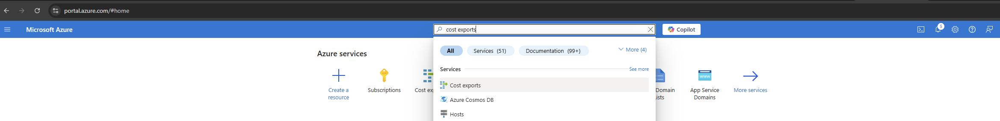
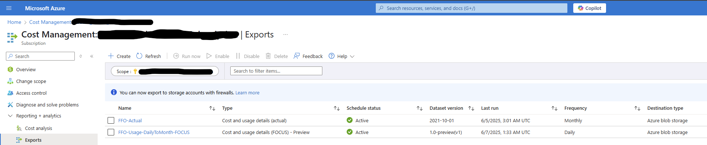
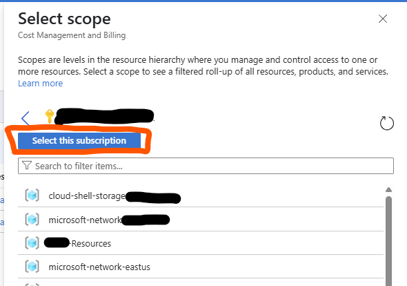
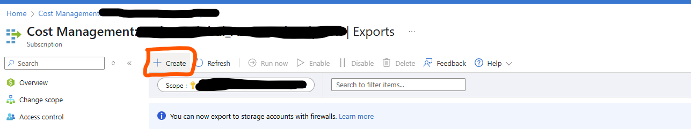
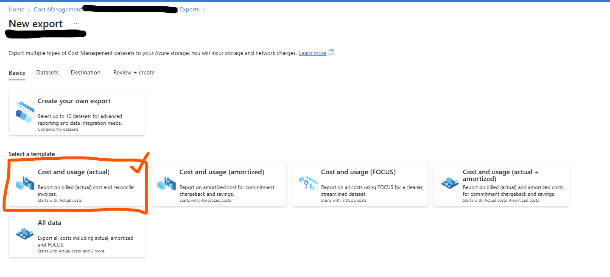
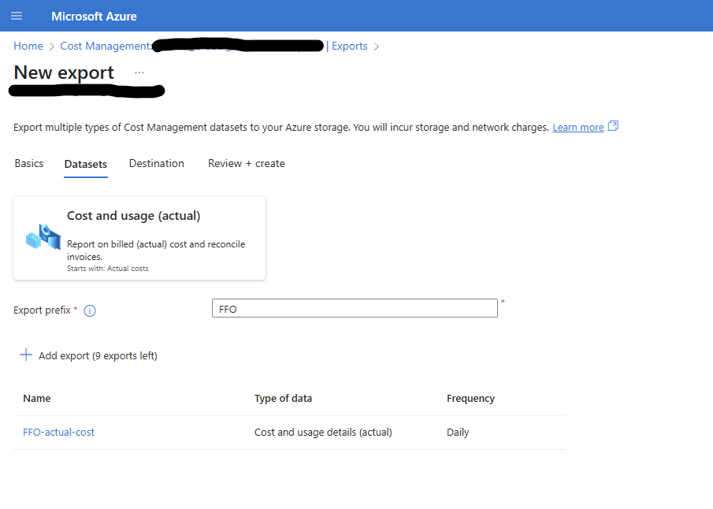
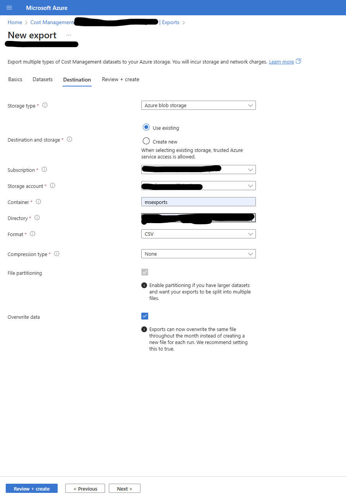

# Guidance on Setting Up a New Cost Export

---

## 1️⃣ Open Cost Exports

From the Azure portal home page, search for **"Cost exports"**, and select it.

---

## 2️⃣ Select Scope

In the **Cost Management** page, select **Reporting + analytics / Exports** (this is usually the default page). Then choose the correct scope as shown below:

---

## 3️⃣ Set Scope

After clicking the button, a side panel will appear. Find the correct Subscription and click **"Select this subscription"** as the scope:

---

## 4️⃣ Create New Export

Click the **"+ Create"** button to start creating a new export:

---

## 5️⃣ Configure Export Steps

### Step 1: Choose Export Template

For **Float FinOps** use case, the preferred template is:

- **Cost and usage (actual)**

---

### Step 2: Datasets

- No changes required here.
- Fill the **Export prefix** field with a proper value, typically using `FFO` (stands for Float FinOps):

---

### Step 3: Destination

This step defines the destination for the exported invoice file. It should be a container in one of your storage accounts.

### Prerequisite:

Before setting up the export, ensure you have already run the required template to create:

- Resource group: `rg-floatfinops`
- Storage account with container: `msexports`

### Configuration:

1. **Storage type**: `Azure blob storage`
2. **Destination and storage**: `Use existing`  
    _If `rg-floatfinops` does not exist, run the template first._
3. **Subscription**: Select the subscription where `rg-floatfinops` is located.
4. **Storage account**: Select the storage account in `rg-floatfinops`.
5. **Container**: `msexports` _(used by Float FinOps analysis service)_
6. **Directory**: `subscriptions/00000000-0000-0000-0000-000000000000`  
   _(replace with your actual `subscriptionId`)_
7. **Format**: `CSV`
8. **Compression type**: `None`
9. **File partitioning**: _Disabled_ (leave as default)
10. **Overwrite data**: _Checked_ (to keep only the newest file)

Example screenshot:

---

## 6️⃣ Finalize

Click **"Review + Create"** to complete and create the new export.

---
